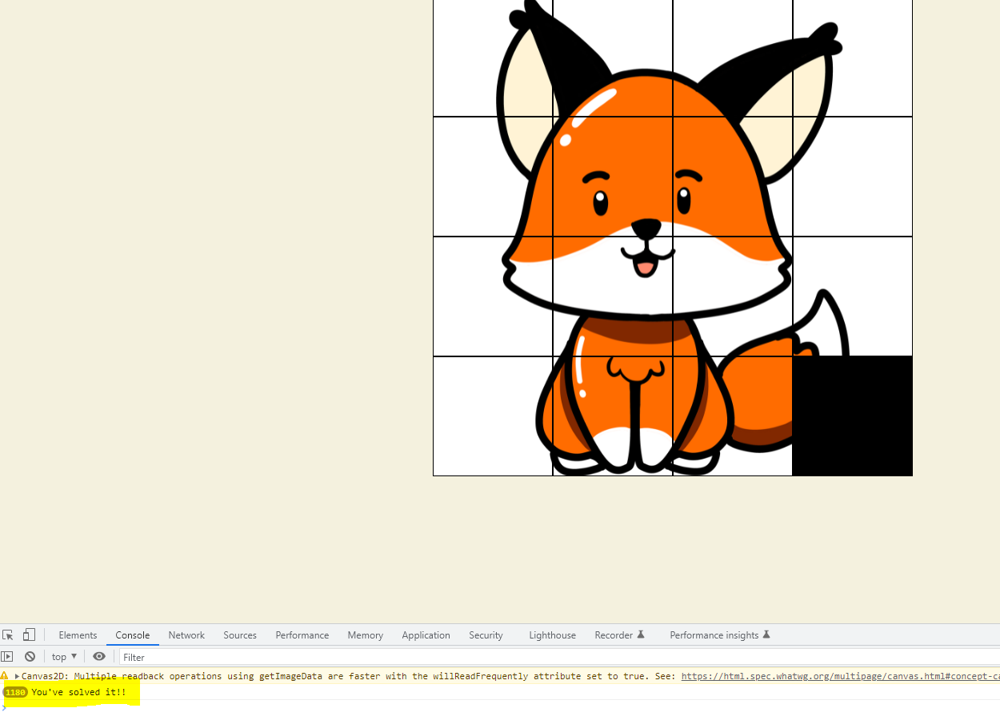
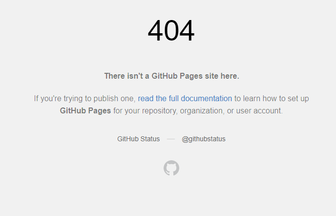

# Jigsaw-puzzle-game
## Table of Contents
- [About](https://github.com/AiGaA/Jigsaw-puzzle-game#about)
    - [Site purpose](https://github.com/AiGaA/Jigsaw-puzzle-game#site-purpose)
    - [Target audience](https://github.com/AiGaA/Jigsaw-puzzle-game#target-audience)
    - [Goals](https://github.com/AiGaA/Jigsaw-puzzle-game#goals)
- [Design](https://github.com/AiGaA/Jigsaw-puzzle-game#design)
    - [Wireframes](https://github.com/AiGaA/Jigsaw-puzzle-game#wireframes)
    - [Color Scheme](https://github.com/AiGaA/Jigsaw-puzzle-game#color-scheme)
    - [Typography](https://github.com/AiGaA/Jigsaw-puzzle-game#typography)
    - [Images](https://github.com/AiGaA/Jigsaw-puzzle-game#images)
- [Technologies Used](https://github.com/AiGaA/Jigsaw-puzzle-game#technologies-used)
    - [Frameworks](https://github.com/AiGaA/Jigsaw-puzzle-game#frameworks)
- [Testing](https://github.com/AiGaA/Jigsaw-puzzle-game#testing)
    - [Validator Testing](https://github.com/AiGaA/Jigsaw-puzzle-game#validator-testing)
    - [Bugs](https://github.com/AiGaA/Jigsaw-puzzle-game#bugs)
    - [Unfixed Bugs](https://github.com/AiGaA/Jigsaw-puzzle-game#unfixed-bugs)
- [Deployment](https://github.com/AiGaA/Jigsaw-puzzle-game#deployment)
- [Credits](https://github.com/AiGaA/Jigsaw-puzzle-game#credits)

## About
Jigsaw Puzzle Game is fun and interactive site for kids and grownups where you can enjoy solving fun and colourful puzzles.

### Site Purpose
Playing puzzles can be very beneficial to kids and as well as adults. Playing puzzle games can be great fun, it sharpens your mind, develop memory skills, as well as an abiliy to plan, test ideas and solve problems.

### Target Audience
This site is developed for anyone and any age group who enjoys games, puzzles, or just like to have fun.

### Goals
This site is goals are bringing some positivity and to create fun environtment for its users.

## Design
### Wireframes
For this project I have used Balsamiq tool to create layout and design for the game. 
Screenshots for Web page:

## Testing
### Validator Testing

### Bugs

When implemented isSolved() function to the puzzle to show when puzzle has been solved in console.log it was going in infinte loop. 
The function call was misplaced and this was fixed by placing it into draw() function in js file, which have solved the issue. 

When project was deployed bug below was coming up on accessing pages on the website, due to some file path declarations. This issue was resolved by fixing path to files and checked throughout the project making sure this does not happen.

# Deployment

This site was built using [GitHub Pages](https://pages.github.com/).