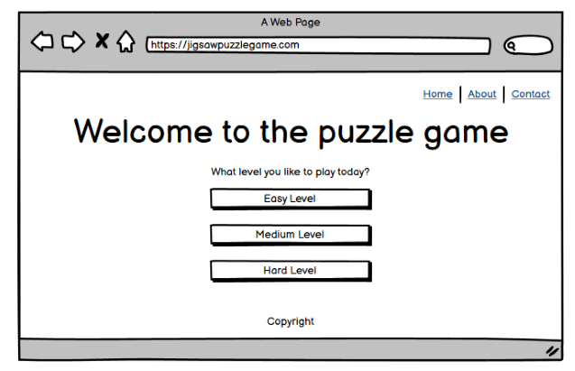

# Jigsaw-puzzle-game
## Table of Contents
- [About](https://github.com/AiGaA/Jigsaw-puzzle-game#about)
    - [Site purpose](https://github.com/AiGaA/Jigsaw-puzzle-game#site-purpose)
    - [Target audience](https://github.com/AiGaA/Jigsaw-puzzle-game#target-audience)
    - [Goals](https://github.com/AiGaA/Jigsaw-puzzle-game#goals)
- [Design](https://github.com/AiGaA/Jigsaw-puzzle-game#design)
    - [Wireframes](https://github.com/AiGaA/Jigsaw-puzzle-game#wireframes)
    - [Color Scheme](https://github.com/AiGaA/Jigsaw-puzzle-game#color-scheme)
    - [Typography](https://github.com/AiGaA/Jigsaw-puzzle-game#typography)
    - [Images](https://github.com/AiGaA/Jigsaw-puzzle-game#images)
- [Technologies Used](https://github.com/AiGaA/Jigsaw-puzzle-game#technologies-used)
    - [Frameworks](https://github.com/AiGaA/Jigsaw-puzzle-game#frameworks)
- [Testing](https://github.com/AiGaA/Jigsaw-puzzle-game#testing)
    - [Validator Testing](https://github.com/AiGaA/Jigsaw-puzzle-game#validator-testing)
    - [Bugs](https://github.com/AiGaA/Jigsaw-puzzle-game#bugs)
    - [Unfixed Bugs](https://github.com/AiGaA/Jigsaw-puzzle-game#unfixed-bugs)
- [Deployment](https://github.com/AiGaA/Jigsaw-puzzle-game#deployment)
- [Credits](https://github.com/AiGaA/Jigsaw-puzzle-game#credits)

## Design
### Wireframes
For this project I have used Balsamiq tool to create layout and design for the game. 
Screenshots for Web page:

