# Jigsaw-puzzle-game
## Table of Contents
- [About](https://github.com/AiGaA/Jigsaw-puzzle-game#about)
    - [Site purpose](https://github.com/AiGaA/Jigsaw-puzzle-game#site-purpose)
    - [Target audience](https://github.com/AiGaA/Jigsaw-puzzle-game#target-audience)
    - [Goals](https://github.com/AiGaA/Jigsaw-puzzle-game#goals)
- [Design](https://github.com/AiGaA/Jigsaw-puzzle-game#design)
    - [Wireframes](https://github.com/AiGaA/Jigsaw-puzzle-game#wireframes)
    - [Color Scheme](https://github.com/AiGaA/Jigsaw-puzzle-game#color-scheme)
    - [Typography](https://github.com/AiGaA/Jigsaw-puzzle-game#typography)
    - [Images](https://github.com/AiGaA/Jigsaw-puzzle-game#images)
- [Technologies Used](https://github.com/AiGaA/Jigsaw-puzzle-game#technologies-used)
    - [Frameworks](https://github.com/AiGaA/Jigsaw-puzzle-game#frameworks)
- [Testing](https://github.com/AiGaA/Jigsaw-puzzle-game#testing)
    - [Validator Testing](https://github.com/AiGaA/Jigsaw-puzzle-game#validator-testing)
    - [Bugs](https://github.com/AiGaA/Jigsaw-puzzle-game#bugs)
    - [Unfixed Bugs](https://github.com/AiGaA/Jigsaw-puzzle-game#unfixed-bugs)
- [Deployment](https://github.com/AiGaA/Jigsaw-puzzle-game#deployment)
- [Credits](https://github.com/AiGaA/Jigsaw-puzzle-game#credits)

## About
Jigsaw Puzzle Game is fun and interactive site for kids and grownups where you can enjoy solving fun and colourful puzzles. 

This game has 3 levels: Easy, Medium and Hard to choose from. Each puzzle has their own set of squares. 

- Easy Level is 3x3 squares and has simple image of Fox. This shuffles 50 times and is the most easiest puzzle to solve.   
    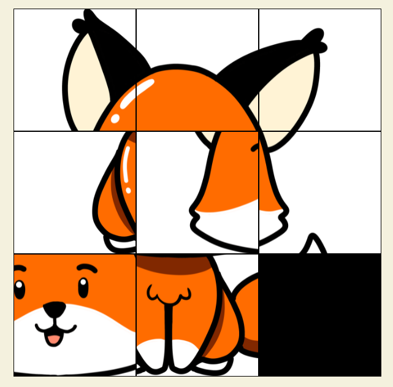
- Medium Level is 4x4 squares and has little bit more colorful image. This shuffles 100 times and is a little trickier to solve.   
    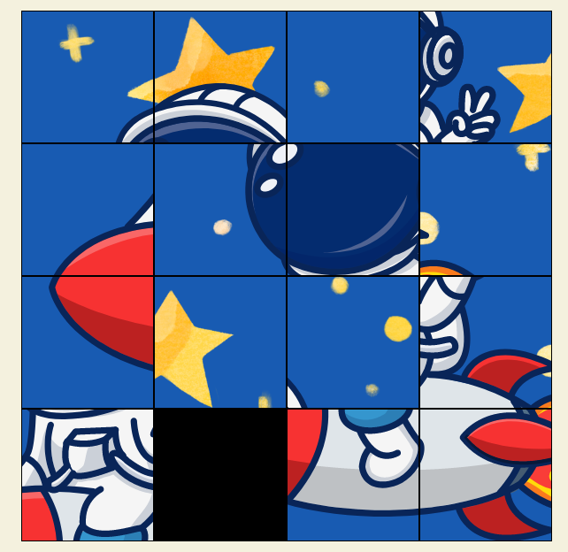
- Hard Level game is 5x5 squares and is hardest to solve. It has very colourful image, and will take more time and patience to solve this puzzle.   
    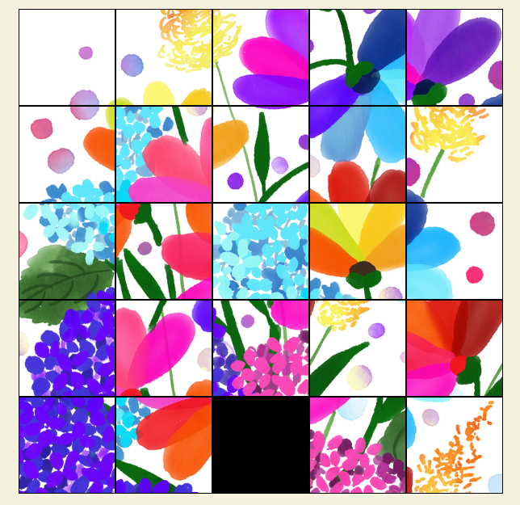

Each puzzle has a 'Show Image' button at the bottom that allows to see what image has to look like.   
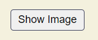

Each puzzle has a 'Refresh' button, that shuffles the image again.   
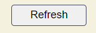

### Site Purpose
- Playing puzzles can be very beneficial to kids and as well as adults. 
- Playing puzzle games can be great fun, it sharpens your mind, develop memory skills, as well as an abiliy to plan, test ideas and solve problems.

### Target Audience
- This site is developed for anyone and any age group who enjoys games, puzzles, or just like to have fun.
- This site is developed with thaught that it easy accessable to all users. Compatibility with different device sizes makes this game accessable to play easy on desktop or the mobile device.
- Different levels of the game makes more fun to challenge inner self. 

### Goals
- To bring some positivity and to create fun environtment for its users.
- To offer a user-friendly game that is simple to play and comprehend.
- To produce code that complies with best practices.

## Design
### Wireframes
For this project Balsamiq tool was used to create layout and design for the game. 
- Screenshots for Web page:   
      
    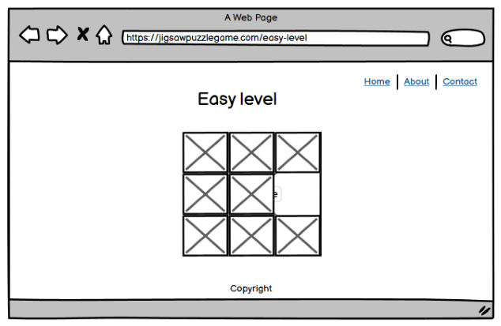  
    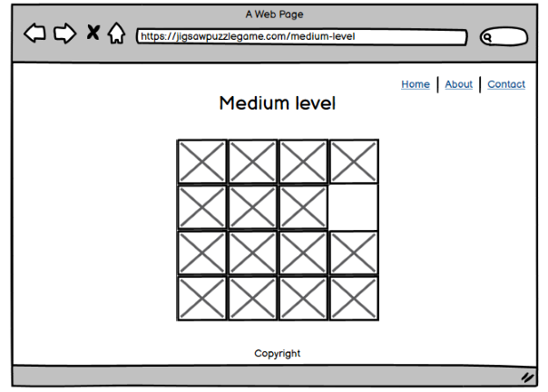  
    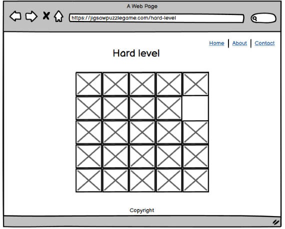  
    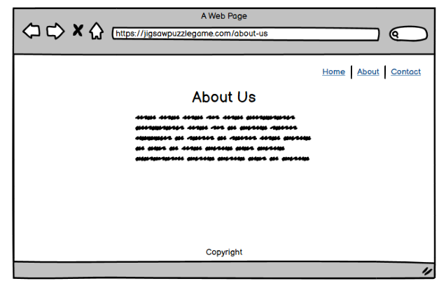  
    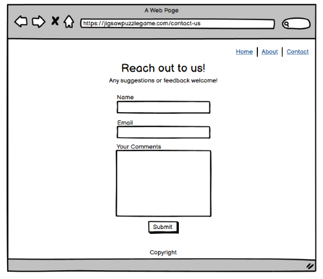  

### Color Scheme
The color scheme for thsi project was to choose a neutral colors, as the images would be bright and that would be the focus for the website. 
The color palette I chose to use was taken from [coolors.co](https://coolors.co/palette/f4f1de-e07a5f-3d405b-81b29a-f2cc8f) website.  
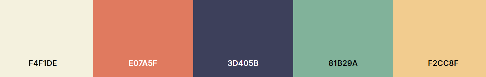

### Typography
For typography I chose to use downloadable [Google Fonts](https://fonts.google.com/specimen/Montserrat?query=Montserrat).
These are three fonts that are used: Montserrat-Bold, Montserrat-Regular and Montserrat-Thin. If the browser does not support these fonts it should fall back to sans-serif.

### Images
All images used in this project were custom made. All puzzle images were created using free design tool [Canva](https://www.canva.com/). This tool is very easy to use, and has good variety of free patterns, backgrounds and graphics.

## Testing
### Validator Testing

- HTML 
    - An error was returned when testing website through the official [W3C validator](https://validator.w3.org/nu/?doc=https%3A%2F%2Faigaa.github.io%2FJigsaw-puzzle-game%2F)  
    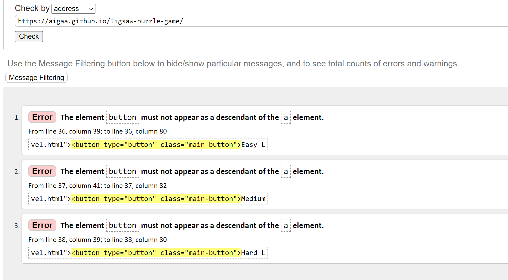 
    - A warning was displayed for js script type attribute on easy-level.html, medium-level.html and hard-level.html pages  
    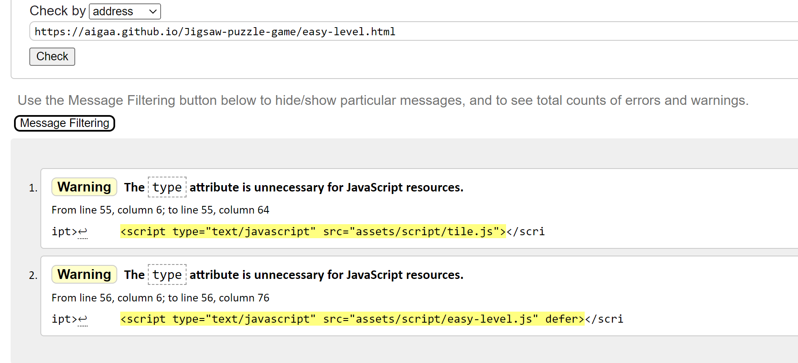 
    - These issues were fixed and returned no errors  
       

- CSS  
    - There were no errors found when testing through the official [W3C CSS Validator](https://jigsaw.w3.org/css-validator/validator?uri=https%3A%2F%2Faigaa.github.io%2FJigsaw-puzzle-game%2Findex.html&profile=css3svg&usermedium=all&warning=1&vextwarning=&lang=en#css)  
    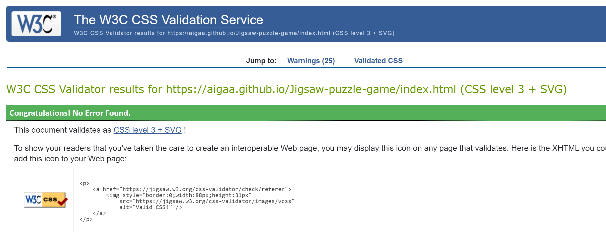  

- JavaScript  
    - JavaScript tested using [BeautifulTools](https://beautifytools.com/javascript-validator.php)  
    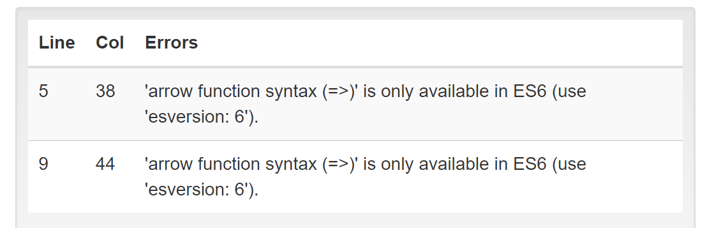 

### Bugs

When implemented isSolved() function to the puzzle to show when puzzle has been solved in console.log it was going in infinte loop. 
The function call was misplaced and this was fixed by placing it into draw() function in js file, which have solved the issue. 

When project was deployed bug below was coming up on accessing pages on the website, due to some file path declarations. This issue was resolved by fixing path to files and checked throughout the project making sure this does not happen. This issue was showing only on deployed pages. Made multiple repetative commits due to this issue. 
Clearing cache helped to resolve this.

# Deployment

This site was built using [GitHub Pages](https://pages.github.com/).

